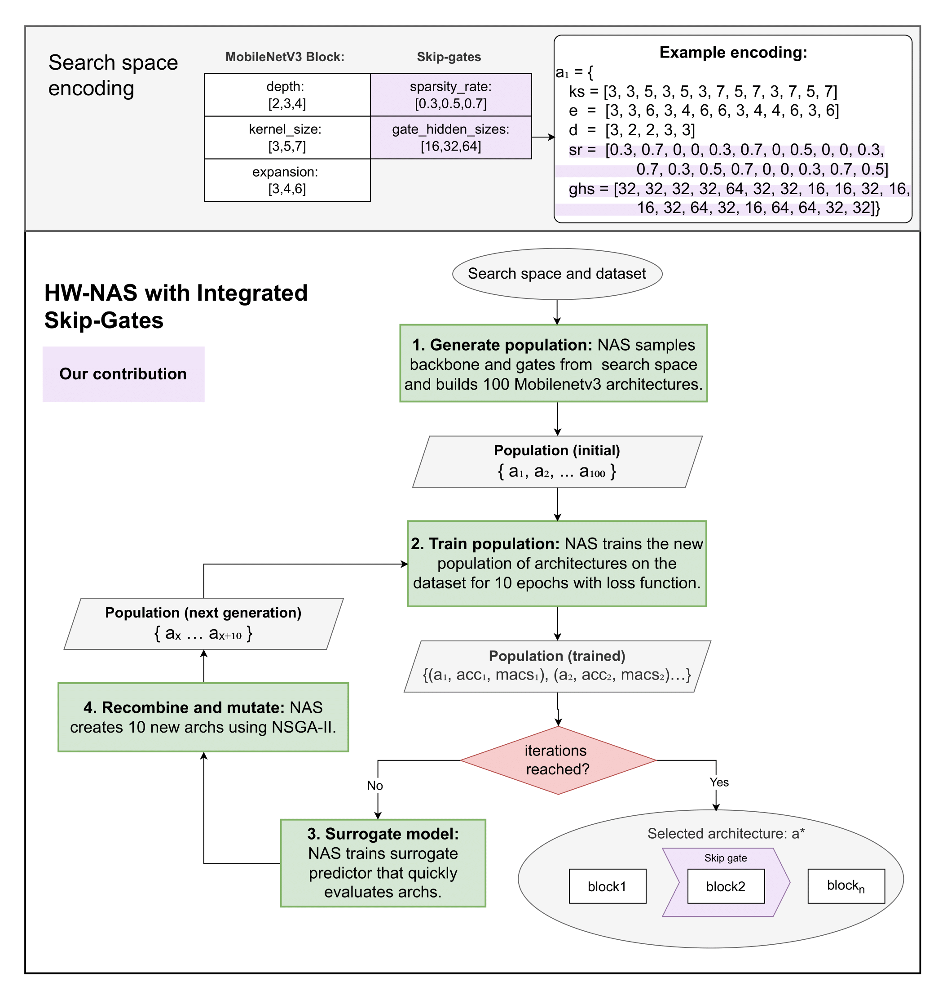

This repository contains the code for the thesis "Designing
Input-Dependent
Layer-Skipping Networks
with Hardware-Aware
NAS". The repository is expanded and adapted from 
https://github.com/mikelzc1990/nsganetv2.git and https://github.com/AI-Tech-Research-Lab/CNAS.git
## Overview




## Requirements

1. Install requirements with `pip install -r requirements.txt`

## Contents

- `scripts` contains the scripts needed to perform a search using NAS.
- `results` contains the architecture found by search procedure.
- `NasSearchSpace` contains the available search spaces.
- `NasSearchSpace/ofa/supernets` contains the pretrained weights of the OFA supernets.
- `acc_predictor` contains the accuracy predictors used to evaluate candidate networks in the NAS search.
- `EarlyExits` contains the trainer and the utilities for EDANAS
- `Layerskipping` contains the trainer and the utilities for Layerskipping

## Dataset
The datasets are automatically downloaded when running the NAS search.
| Dataset | Type | Train Size | Test Size | #Classes |
|:-:|:-:|:-:|:-:|:-:|

| [CIFAR-10](https://www.cs.toronto.edu/~kriz/cifar.html) | | 50,000 | 10,000 | 10 |
| [CIFAR-100](https://www.cs.toronto.edu/~kriz/cifar.html) |  | 50,000 | 10,000 | 100 |


- To launch the search, you can run a search command from the `scripts` folder.
- Output file structure:
  - Every architecture sampled during search has `net.subnet` and `net.stats` stored in the corresponding iteration dir. 
  - A stats file is generated by the end of each iteration, `iter_x.stats`; it stores every architectures evaluated so far in `["archive"]`, and iteration-wise statistics

## Post search
Once the search is completed, you can find optimal architectures by running `post_search` in the `scripts` folder.

## Visualization

After training, you can analyze and visualize the results using the following tools. All analysis outputs are saved to `results/analysis/` by default, with automatic subdirectories created for each experiment to prevent overwriting results.

### Analyze Gate Usage
Analyze skipping gate behavior for trained layer-skipping models, including per-gate open probabilities, per-class gate averages, and MAC usage:

```bash
python tools/analyze_gates.py \
    --model_path results/your_experiment/final/net-trade-off_0/ckpt.pth \
    --subnet results/your_experiment/final/net-trade-off_0/net.subnet \
    --supernet_path ./NasSearchSpace/ofa/supernets/ofa_mbv3_d234_e346_k357_w1.0 \
    --dataset cifar100 \
    --n_classes 100 \
    --data ./data \
    --device cuda:0
```

**Outputs:** Gate usage heatmaps, per-class analysis, sample images automatically saved to `results/analysis/gates/your_experiment/`

### Visualize Final Architectures
Compare final architectures across different experiments by plotting MACs vs Accuracy trade-offs:

```bash
python tools/visualize_final_architectures.py \
    --results_dir ./results \
    --dataset all
```

**Outputs:** Architecture comparison plots (PNG and PDF) saved to `results/analysis/architectures/`

### Analyze Surrogate Model Feature Importance
Analyze which architecture features (depth, kernel size, expansion ratio, gate sizes) are most important for the surrogate predictor:

```bash
python tools/analyze_surrogate_importance.py \
    --expr results/your_experiment \
    --predictor carts \
    --search_space layerskipping \
    --top_k 20 \
    --plot
```

**Outputs:** Feature importance plots and JSON data automatically saved to `results/analysis/surrogate/your_experiment/`

**Note:** The tools automatically create unique subdirectories based on the experiment name from the input paths. You can override this by explicitly specifying `--output_dir`.

  
